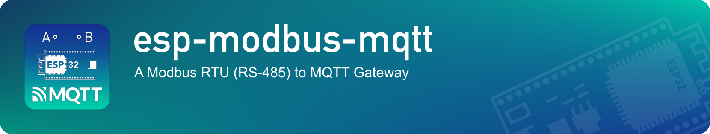

[](https://travis-ci.com/gmasse/esp-modbus-mqtt)

## Circuit

Auto-switching UART-to-RS485 converter:
```

                   VCC ---------------+
                                      |
                              +-------x-------+
        (PIN27)    RXD <------| RX            |
                              |      UART    B|----------<> B
        (PIN26)    TXD ------>| TX    TO      |
ESP32                         |     RS-485    |     RS485 bus side
                              |               |
                              |              A|----------<> A
                              |               |
                              +-------x-------+
                                      |
                                     GND
```
Manual switching UART-to-RS485 converter:
```
                   VCC ---------------+
                                      |
                              +-------x-------+
        (PIN27)    RXD <------| R             |
                              |      UART    B|----------<> B
        (PIN26)    TXD ------>| D     TO      |
ESP32                         |     RS-485    |     RS485 bus side
        (PIN25)    RTS --+--->| DE            |
                         |    |              A|----------<> A
                         +----| /RE           |
                              +-------x-------+
                                      |
                                     GND
```
NB: ESP32 pins are configurable at compilation time.

## Modbus

Device acts as Modbus Master, regurlaly polling a list of registers from a Modbus Slave.

List of Modbus parameters (in `platformio.ini` file):
 - `modbus_rxd`: RX/R pin number (default: `27`)
 - `modbus_txd`: TX/D pin number (default: `26`)
 - `modbus_rts`: DE/RE pin number (default: `25`). If you don't need RTS, use `NOT_A_PIN` value.
 - `modbus_baudrate` (default: `9600`)
 - `modbus_unit`: Modbus Slave ID (default: `10`);
 - `modbus_retries`: if a Modbus request fails, number of retries before passing to the next register (default: `2`)
 - `modbus_scanrate`: the device will attempt to poll the slave every XX seconds (default: `30`)

Registers list is defined by the array `registers[]` in `src/modbus_registers.h`.
A very simple example would be:
```
const modbus_register_t registers[] = {
    { 123, MODBUS_TYPE_HOLDING, REGISTER_TYPE_U16, "value_123" },
    { 124, MODBUS_TYPE_HOLDING, REGISTER_TYPE_U16, "value_124" }
};
```
Where:
 - `123` and `124` are register address to read,
 - `MODBUS_TYPE_HOLDING` is the Modbus object type to read,
 - `REGISTER_TYPE_U16` is the expected format of the returned value,
 - `value_123` and `value_124` are the name in the JSON MQTT message

#### Supported Modbus objects:
 - `HOLDING` type is supported and has been tested
 - `INPUT`, `COIL`, `DISCRETE` and `COUNT` has not been tested but should work

#### Supported returned Value:
 - `REGISTER_TYPE_U16`: unsigned 16-bit integer
 - `REGISTER_TYPE_BITFIELD`: a sequence of 16 (or less) single bits; the first item maps the least significant bit
 - `REGISTER_TYPE_DIEMATIC_ONE_DECIMAL`: a specific De-Dietrich signed decimal implementation
 - `REGISTER_TYPE_DEBUG`: hexadecimal value only visible in INFO logs (not sent in MQTT message)
 - other types are not supported (TODO src/modbus_base.cpp:readModbusRegisterToJson)

## MQTT

MQTT parameters are passed through environment variables:
 - `PIO_MQTT_HOST_IP`: MQTT broker IPv4
 - `PIO_MQTT_PORT`: MQTT broker port
 - `PIO_MQTT_TOPIC`: root prefix of the published topic

With `PIO_MQTT_TOPIC=MyTopic`, based on the register list example above, the published MQTT message will be:
```
Topic: MyTopic/ESP-MM-ABCDEF012345/data
Message: {"value_123":0,"value_124":65536}
```
Where `ABCDEF012345` is the ESP unique Chip ID.

## Compilation

```
git clone https://github.com/gmasse/esp-modbus-mqtt.git
cd esp-modbus-mqtt
python3 -m venv venv
source venv/bin/activate
pip install -U platformio
hash -r
cp platformio.ini.dist platformio.ini
(edit platformio.ini if needed)
export PIO_FIRMWARE_URL="http://domain.com/firmware.bin"
export PIO_MQTT_HOST_IP=11.22.33.44
export PIO_MQTT_PORT=1883
export PIO_MQTT_TOPIC=mytopic
platformio run
```

Built firmware will be at `.pio/build/fm-devkit/firmware.bin`
You can upload to ESP with: `platformio run upload`

## TODO

- [ ] Configuration (Wifi credentials) Reset
- [ ] Factory Firmware (https://docs.espressif.com/projects/esp-idf/en/latest/api-guides/bootloader.html)
- [ ] Secure Boot
- [ ] Moving to ESP-IDF Framework
- [ ] Log level update at runtime

## FAQ
#### Passing environment variables via VS Code
Edit `.vscode/settings.json` and add the following lines:
```
  "terminal.integrated.env.osx": {
    "PIO_FIRMWARE_URL": "https://url/firmware.bin",
    "PIO_MQTT_HOST_IP": "11.22.33.44",
    "PIO_MQTT_PORT": "1883",
    "PIO_MQTT_TOPIC": "mytopic"
  },
```

#### Flashing firmware
```
cp .plateformio/packages/framework-arduinoespressif32/tools/sdk/bin/bootloader_dio_40m.bin .
cp .platformio/packages/framework-arduinoespressif32/tools/partitions/default.bin .

esptool.py --chip esp32 --port /dev/ttyUSB1 --baud 460800 \
 --before default_reset --after hard_reset write_flash -z \
 --flash_mode dio --flash_freq 40m --flash_size detect \
 0x1000 bootloader_dio_40m.bin 0x8000 default.bin 0x10000 firmware.bin
```
